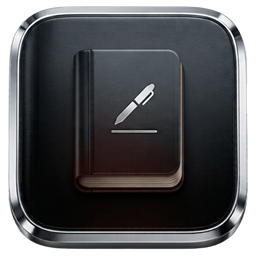

# LitePad

A bloat-free, fast, **zero-telemetry** notepad for Windows. Native Rust (egui/eframe) —
no Electron, no web view, no background services. A single ~4 MB `.exe`.

## Features

- **Autosave** — a live indicator shows a spinner + "Saving…" as you type and settles to
  "✓ Saved"; writes to disk 0.7 s after you stop, on note switch, and on close.
- **Sidebar** — all notes listed macOS-style (title, preview, relative time), newest first.
  Its font is fixed and never changes when you resize the editor text.
- **Search** — filter notes instantly (`Ctrl+F`).
- **Save As…** — export the current note anywhere via a native Windows dialog (`Ctrl+Shift+S`).
- **Themes** — three built-in: **Light**, **Dark**, and a warm **Brown**. Solid colors,
  rounded corners, no gradients. The toolbar button cycles Light → Dark → Brown.
- **Fonts** — pick from 4 real Windows fonts (Segoe UI, Arial, Georgia, Consolas), adjustable
  size (`Ctrl +` / `Ctrl -`), with **Bold / Italic / Underline** toggles applied to the editor.
- **Clickable links** — `http(s)` URLs are highlighted; `Ctrl+Click` opens them in your browser.
- **Standard editing** — copy / cut / paste / select-all / undo / redo (native `Ctrl+C/X/V/A/Z`).
- **Shortcuts panel** — click **Shortcuts** in the toolbar for the full list.
- **Plain-text files** — reads & writes `.txt`, `.md`, `.markdown`, `.log`, `.csv`, `.conf`.
- **No networking** — there is no network code in the project *at all*. It never phones home.

## Where notes live

`%APPDATA%\LitePad\notes\` — one real text file per note, named after its first line.
Drop your own `.txt`/`.md` files in there and they show up in the sidebar. Preferences are
stored in `%APPDATA%\LitePad\config.txt`. The **Folder** button opens this in Explorer.
(Notes from an earlier `RustPad` install are migrated automatically on first launch.)

## Shortcuts

| Action              | Keys                    |
|---------------------|-------------------------|
| New note            | `Ctrl+N`                |
| Save now            | `Ctrl+S`                |
| Save As… (export)   | `Ctrl+Shift+S`          |
| Search              | `Ctrl+F`                |
| Delete note         | `Ctrl+D` (or right-click a card) |
| Bold / Italic / Underline | `Ctrl+B` / `Ctrl+I` / `Ctrl+U` |
| Bigger / smaller text | `Ctrl+=` / `Ctrl+-`   |
| Select all          | `Ctrl+A`                |
| Cut / Copy / Paste  | `Ctrl+X` / `Ctrl+C` / `Ctrl+V` |
| Undo / Redo         | `Ctrl+Z` / `Ctrl+Y`     |
| Open link           | `Ctrl+Click`            |

## Build & run

```powershell
cargo run --release
```

The optimized binary is at `target\release\litepad.exe` — copy it anywhere and double-click.
```
